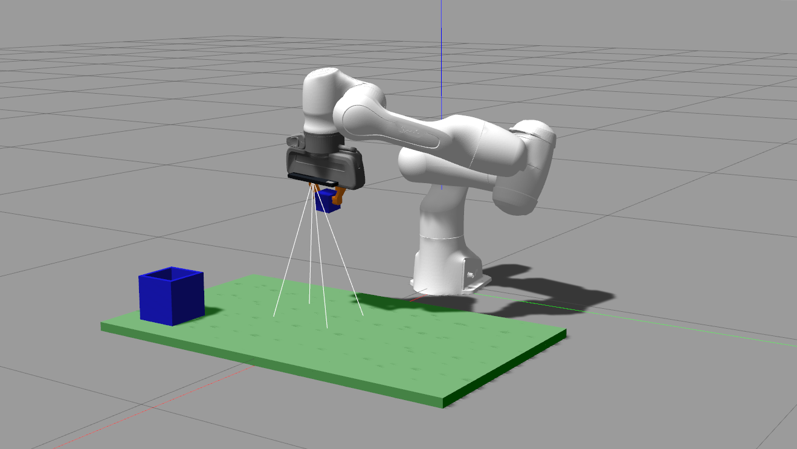
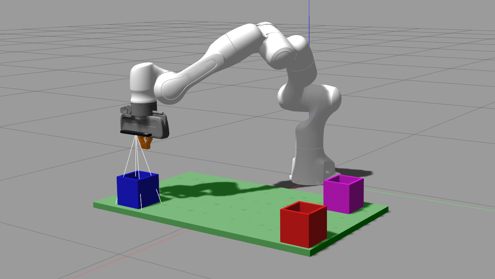
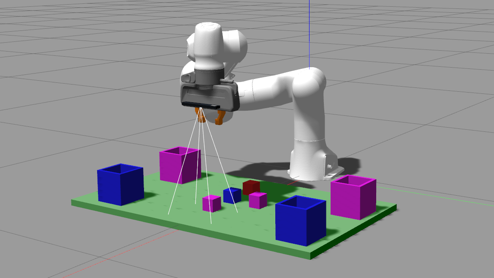

# COMP0129 Coursework 1 Team 2 

Created by Colin Laganier, Jacob Nash, Carl Parsons as part of COMP0129 of UCL's MSc of Robotics and Computation.

## Requirements

To run this task following packages are required: 
- ROS Noetic
- Point Cloud Library
- MoveIt

## Usage

Download the repository and add it as a package in your catkin environment (in /src folder). To build the package run in one terminal: 
```console
foo@bar:~/catkin_ws$ catkin build
```

To start the code, use the provided launch script:
```console
foo@bar:~/catkin_ws$ source devel/setup.bash
foo@bar:~/catkin_ws$ roslaunch cw1_team_2 run_solution.launch
```

The specific tasks should be launched from a separate, sourced terminal. 

## Description 


### Task 1
*Colin 33%, Jacob 33%, Carl 33% (1 hour)*




Goal of Task 1 is to pick up cubes and drop them in a given basket. The coordinates are randomly generated when spawned and the coordinates are given in /task 1 service request.

```console
foo@bar:~catkin_ws$ rosservice call /task 1
```
### Task 2
*Colin 33%, Jacob 33%, Carl 33% (45 hour)*



Goal of Task 2 is to identify the colour of the baskets at given coordinates. The coordinates are randomly generated when spawned and the coordinates are given in /task 2 service request.

```console
foo@bar:~catkin_ws$ rosservice call /task 2
```
The identified colours are outputted in the ROS console as such:
```console
[ INFO] [1676647948.750793379, 36.816000000]: /////////////////////////////////////////////////////////////////////
[ INFO] [1676647948.750808797, 36.816000000]: Baskets: [blue, red, purple, none]
[ INFO] [1676647948.750822523, 36.816000000]: /////////////////////////////////////////////////////////////////////
```
### Task 3
*Colin 33%, Jacob 33%, Carl 33% (65 hour)*



Goal of task 3 is to identify the cubes and baskets in the environment and placing each cube into a basket of the same colour if possible. No coordinates are given and are instead computed using the depth camera. 

```console
foo@bar:~catkin_ws$ rosservice call /task 3
```

---
Github Repo: https://github.com/colinlaganier/COMP0129-CW1

This project is [MIT](LICENSE) licensed.

